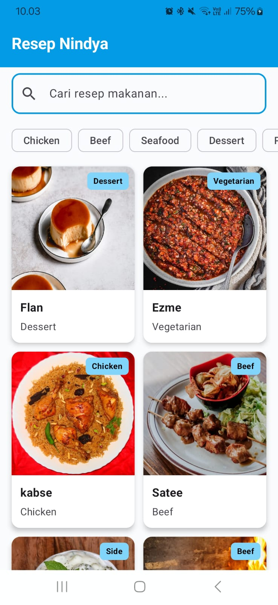
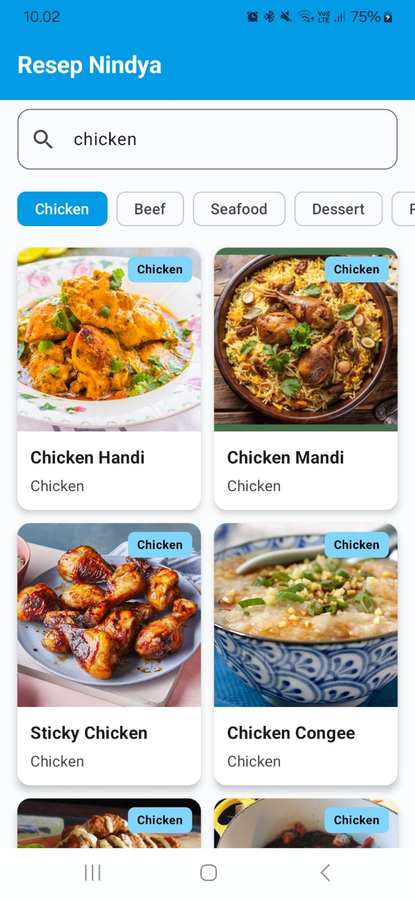
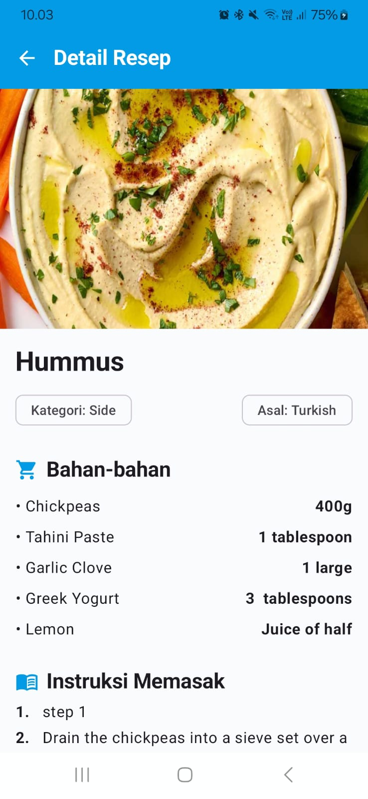

# ResepNindya
> Katalog dan Eksplorasi Resep Makanan Global

---

## 👤 Identitas Praktikan
- **Nama Lengkap:** Nindya Alif Romland
- **NIM:** H1D024031
- **Shift Awal:** Shift D
- **Shift Akhir:** Shift E
- **Link Video Demo/Penjelasan:** [Isi Link YouTube/Google Drive Kamu](https://...)

---

## 📱 Deskripsi Aplikasi
ResepNindya adalah aplikasi mobile yang dikembangkan untuk membantu pengguna mencari, melihat, dan mengeksplorasi resep makanan dari berbagai negara. Dengan antarmuka yang modern, pengguna bisa mendapatkan inspirasi masakan lengkap dengan daftar bahan, takaran, serta instruksi memasak langkah demi langkah secara mudah. Aplikasi ini mengambil data secara dinamis (real-time) menggunakan TheMealDB REST API.

---

## 🛠️ Penjelasan Teknis

### 1. Spesifikasi & Tech Stack
- **Bahasa:** Kotlin
- **UI Framework:** Jetpack Compose (Material 3)
- **Min SDK:** 29 | **Target SDK:** 37
- **Pola Arsitektur:** MVVM (Model-View-ViewModel)
- **Library Utama:**
  - `Navigation Compose` (Routing halaman dari Home ke Detail)
  - `ViewModel` & `StateFlow` (State Management untuk Loading, Error, dan Success)
  - `Retrofit` (Networking / HTTP Client untuk TheMealDB API)
  - `Coil` (Asynchronous Image Loading)
  - `Kotlin Coroutines` (Asynchronous processing)

### 2. Fitur Utama
- **Eksplorasi & Grid Katalog (Home Screen):** Menampilkan daftar resep makanan dalam bentuk grid (menggunakan `LazyVerticalGrid`). Gambar di-*load* dengan efisien menggunakan library Coil. UI dikendalikan oleh *state-driven* (menampilkan loading progress saat memuat data).
- **Search Recipe (Pencarian):** Fitur pencarian resep langsung berdasarkan nama makanan. ViewModel akan memantau ketikan (*query*) dan meminta data baru secara asinkron dari Repositori melalui Retrofit.
- **Detail Recipe Screen:** Menampilkan informasi resep komprehensif, mencakup gambar masakan ukuran besar, kategori, asal negara, instruksi memasak, serta kombinasi bahan masakan (Ingredient) dan takarannya (Measure).

### Nilai Tambah (Bonus Features)
1. **Kategori Chip Filter (Home Screen)**: Memudahkan pengguna memfilter masakan berdasarkan kategori populer (*Chicken, Beef, Seafood, Dessert, Pasta*) tanpa harus mengetik manual di kolom pencarian.
2. **Tombol Tutorial Video YouTube (Detail Screen)**: Memanfaatkan data `strYoutube` dari TheMealDB API. Pengguna bisa langsung menekan tombol merah untuk membuka video panduan memasak langsung di aplikasi YouTube.

### 3. Struktur Direktori Proyek
```text
app/src/main/java/com/pemob/resepnindya/
├── data/
│   ├── api/        # Endpoint API (TheMealDbApi) dan RetrofitClient
│   ├── model/      # Data class (MealResponse, Meal)
│   └── repository/ # RecipeRepository (Jembatan antara ViewModel & API)
├── ui/
│   ├── navigation/ # AppNavigation (NavHost dan Rute Halaman)
│   ├── screens/    # HomeScreen (Katalog & Search) & DetailScreen
│   ├── theme/      # Color, Type, Theme Material 3 bawaan Compose
│   └── viewmodel/  # RecipeViewModel (Manajemen state dan logika bisnis)
└── MainActivity.kt # Entry point dari aplikasi
```

### 4. Penjelasan API yang Digunakan
Aplikasi ini menggunakan **TheMealDB API** (Public REST API) yang tidak memerlukan API Key untuk penggunaan dasar. Endpoint utama yang digunakan:

**Search Recipe**
`https://www.themealdb.com/api/json/v1/1/search.php?s={nama_makanan}`
Digunakan pada fitur pencarian dan kategori di Home Screen untuk mengambil daftar resep berdasarkan keyword atau nama makanan.

**Detail Recipe**
`https://www.themealdb.com/api/json/v1/1/lookup.php?i={id_recipe}`
Digunakan pada Recipe Detail Screen untuk mengambil informasi detail resep spesifik berdasarkan ID makanan.

---

## 📸 Tangkapan Layar (Screenshots)

| Home Screen (Katalog) | Pencarian (Search) | Detail Screen |
|:---:|:---:|:---:|
|  |  |  |

---

## 🚀 Cara Menjalankan Proyek

1. **Prasyarat:**
   - Android Studio (Disarankan versi terbaru).
   - JDK 11 atau JDK 17.
   - Emulator atau Perangkat fisik Android (Min API Level 29).

2. **Langkah:**
   ```bash
   # Clone repository ini (jika kamu sudah push ke Github)
   git clone <URL_REPOSITORY_KAMU>
   ```
3. Buka folder proyek **ResepNindya** di **Android Studio**.
4. Tunggu proses **Gradle Sync** hingga sepenuhnya selesai (pastikan koneksi internet stabil).
5. Pilih target perangkat/emulator, lalu klik tombol **Run (`Shift + F10`)**.
